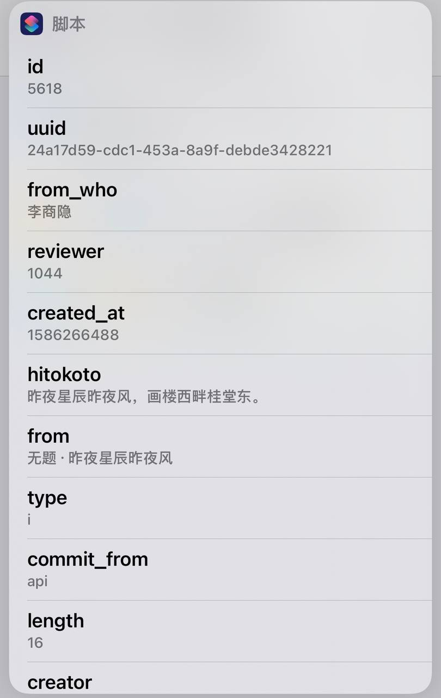

# 2.1.3.2 从输入中获取词典

### 介绍

从传入文本制作词典。支持JSON（如{"foo":"bar"}）、键值对（如foo=bar\&baz=biz）和基于XML的Plist。

### 输入/结果

#### 输入

图像，文本，词典

#### 结果

词典

### 说明

该操作的用途是将**文本类型的数据**序列化为**词典类型**，在这里我只进行以后会最常用到的**JSON**做实验。

```
{
    "id": 5618, 
    "uuid": "24a17d59-cdc1-453a-8a9f-debde3428221", 
    "hitokoto": "昨夜星辰昨夜风，画楼西畔桂堂东。", 
    "type": "i", 
    "from": "无题·昨夜星辰昨夜风", 
    "from_who": "李商隐", 
    "creator": "a632079", 
    "creator_uid": 1044, 
    "reviewer": 1044, 
    "commit_from": "api", 
    "created_at": "1586266488", 
    "length": 16
}
```

这是我从**一言API**请求返回的一段JSON，用作实验，如果你认为这很复杂，那么请使用上文中的简单JSON做测试。（事实上，这个JSON只是多了几项，结构并未变化。）


这里我为了更美观的显示生成的词典，选择了使用**从列表选取**操作，这个命令在以后会讲到。




### 示例

你可以通过导入以下文件来查看本节示例：


